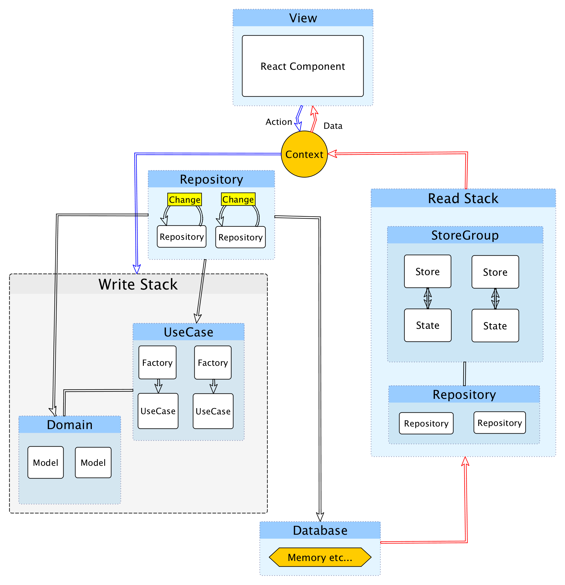

# TodoMVC

In this guide, we’ll walk through the process of creating a simple Todo app.


This todo app is based on [TodoMVC](http://todomvc.com/ "TodoMVC").

## Source Code

You can get source code for counter app from here

- https://github.com/almin/almin/tree/master/example/todomvc

```sh
git clone https://github.com/almin/almin.git

cd almin/example/todomvc
npm install
npm start
# manually open
open http://localhost:8080/
```

## What's learn from Todo app

- What is domain layer?
    - POJO(Plain Old JavaScript Object)
- What is infra layer?
    - Repository
- Which one should you used repository or store?
    - Where is persistent data? - repository
    - Where is data for view? - store

## The purpose of Todo app

Todo app has these UseCases.

- [AddTodoItem.js](../../example/todomvc/src/usecase/AddTodoItem.js)
- [FilterTodoList.js](../../example/todomvc/src/usecase/FilterTodoList.js)
- [RemoveAllCompletedItems.js](../../example/todomvc/src/usecase/RemoveAllCompletedItems.js)
- [RemoveTodoItem.js](../../example/todomvc/src/usecase/RemoveTodoItem.js)
- [ToggleAllTodoItems.js](../../example/todomvc/src/usecase/ToggleAllTodoItems.js)
- [ToggleTodoItem.js](../../example/todomvc/src/usecase/ToggleTodoItem.js)
- [UpdateTodoItemTitle.js](../../example/todomvc/src/usecase/UpdateTodoItemTitle.js)

and system UseCase

- [CreateDomainUseCase.js](../../example/todomvc/src/usecase/CreateDomainUseCase.js)

## Story

We'll implement following work flow and see it.

1. Add Todo item
2. Toggle Todo item's status
3. ... Loop 1,2
4. Filter Todo list and show only non-completed todo items.

## Let's creating, before

Previously, We learn flux pattern to create [counter app](../counter/README.md).


In this guide, We learn basic CQRS(Command Query Responsibility Segregation) pattern using Almin.

CQRS split that conceptual model into separate models - Command(Write) model and Query(Read) model.


In the figure, We called

- Command(Write) model "Write Stack" (Left side of the figure)
    - "Write Stack" get often complex.
    - Because, it has business logic that is well-known as **domain model**.
- Query(Read) model "Read Stack" (Right side of the figure)
    - "Read Stack" is similar concept of ViewModel and Store.

### Domain model

[Domain model](https://en.wikipedia.org/wiki/Domain_model "Domain model")is a object/class that has both behavior and data.
In other word, domain model has property(data) and method(behavior).

## Let's create domain model!

We want to create Todo app, then create `???` as domain model.

Yes, `???` is just `TodoList`!

```js
class TodoList {
    // data and behavior
}
```

### TodoList

`TodoList` class has business logic and manage todo item.

*Todo item* is also domain model.
We going to implement `TodoItem` as value object.

#### TodoItem is value object

`TodoItem` is a simple class that has these data

- `id`: identifier
- `title`: todo title
- `completed`: true or false

[import, TodoItem.js](../../example/todomvc/src/domain/TodoList/TodoItem.js])

### Where domain object are stored?

Now, we can create instance of domain models like that:

```js
const todoList = new TodoList();
const todoItem = new TodoItem({ ... });
todoList.addTodo(todoItem);
```

But, How to store instance of domain as persistence.

We want to introduce **Repository* object.
Repository store domain model for perpetuation.

In the case, repository store domain object into memory database.

Repository is simple class that has these feature:

- Can read/write memory database - memory database is a just `Map` object
- Write domain instance into memory database
- Read domain instance from memory database
- When update memory database, emit "Change" event to subscriber
    - Repository is a just EventEmitter


We want to store `TodoList` instance to the repository.
As a result, We have created `TodoRepository`.

[import, TodoRepository.js](../../example/todomvc/src/infra/TodoRepository.js)

Repository should be persistence object.
In other words, create repository instance as singleton.

Singleton? Does it may make dependencies hell?

Of course, We can resolve that dependencies issue by DIP([Dependency inversion principle](https://en.wikipedia.org/wiki/Dependency_inversion_principle "Dependency inversion principle")).

### DIP

([Dependency inversion principle](https://en.wikipedia.org/wiki/Dependency_inversion_principle "Dependency inversion principle")) is well-known layers pattern.



Domain should not dependant to repository.
Because, Domain don't know how to store itself.
But, Repository can dependant to domain.

## When is domain object created?

We write simply to `index.js`.

Execute [CreateDomainUseCase.js](../../example/todomvc/src/usecase/CreateDomainUseCase.js) and initialize `TodoList` domain and store the instance to repository.

```js
// create domain model and store to repository
appContext.useCase(CreateDomainUseCaseFactory.create()).execute().then(() => {
    // mount app view
    ReactDOM.render(<TodoApp appContext={appContext}/>, document.getElementById("todoapp"));
});
```

## AddTodoItem UseCase

Let's implement business login to `TodoList`.

UseCase: [AddTodoItem](../../example/todomvc/src/usecase/AddTodoItem.js)

### TodoStore 

### TodoStore subscribe changes of repository

### TodoState

## ToggleTodoItem UseCase

### Unidirectional data flow is simple

## FilterTodoList UseCase

### UseCase directly dispatch event to Store

### Already know Flux architecture.

- [ ] Same way of counter app

## Two way of updating store

- [ ] Not meaning two way binding
- [ ] Use unidirectional data flow, but two way
    - Fast path
    - Long path

## View -> UseCase -> (Thinking Point) -> Store

## Conclusion
